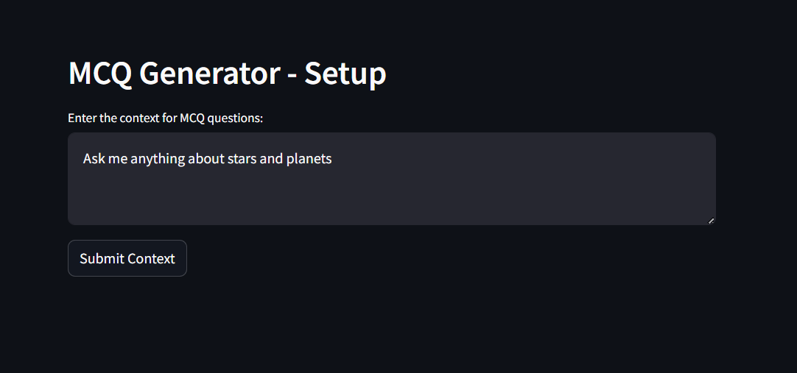
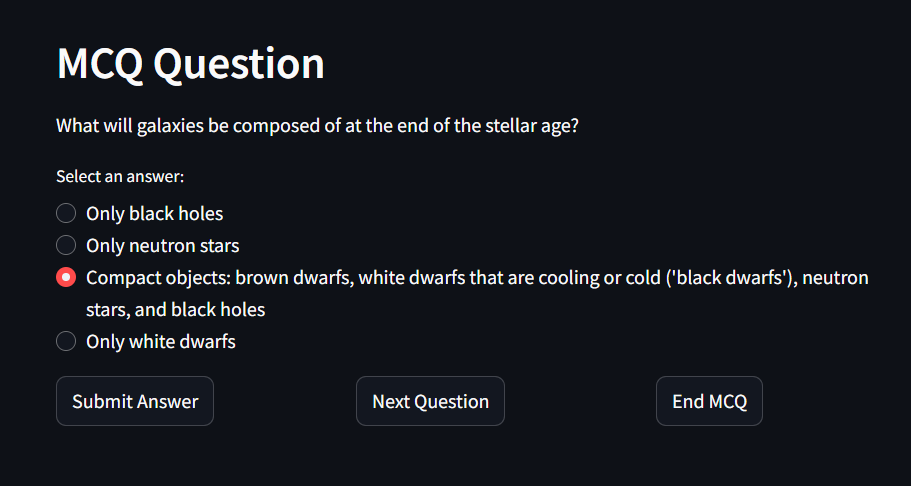
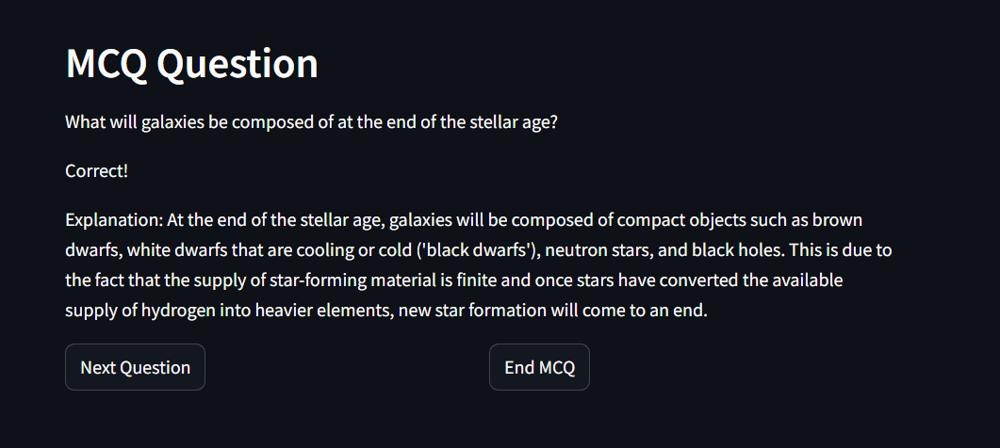
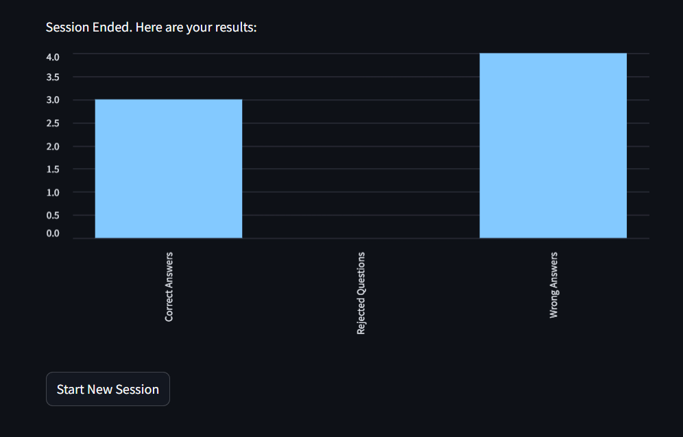

# Learning App

The **Learning App** is a Python-based application designed to generate multiple-choice questions (MCQs) from user-provided queries. It leverages advanced large language models (LLM), such as OpenAI's chat models and Sentence Transformers, to extract relevant information from Wikipedia and create engaging and informative questions.

## Features

- **Dynamic MCQ Generation**: Generates multiple-choice questions based on user queries and Wikipedia content.
- **Keyword Extraction**: Extracts relevant keywords from user queries using AI models.
- **Content Filtering**: Filters Wikipedia pages and sections based on similarity to the user query.
- **Customizable Parameters**: Allows fine-tuning of parameters like the number of keywords, similarity thresholds, and more.
- **Feedback integration**: Skipped questions are used to refine later question generation, preventing repetition.
- **Retry Mechanism**: Retries question generation if the initial attempt fails.

## Prerequisites

### Installing Python 13
The **Learning App** requires **Python 13**. If you don’t have Python 13 installed, follow these steps:

1. Visit the [official Python website](https://www.python.org/downloads/).
2. Download the Python 13 installer for your operating system.
3. Run the installer and follow the on-screen instructions. On Windows, be sure to check “Add Python to PATH.”
4. Open a terminal or command prompt and run the following to verify the installation:
    ```bash
    python --version
    ```
    The output should confirm that Python 13 is installed.

Once Python 13 is installed, continue with the remaining installation steps.

### Setting Up OpenAI API Key
To use the OpenAI API for generating questions, set up the API key as follows:

1. Sign up or log in to an OpenAI account at [OpenAI’s website](https://platform.openai.com/).
2. Open the API Keys section under account settings.
3. Generate a new API key and copy it.
4. In your terminal, set the OPENAI_API_KEY environment variable to your key:

    On Linux/macOS:
    ```bash
    export OPENAI_API_KEY=your-api-key
    ```
    On Windows (Command Prompt):
    ```batch
    set OPENAI_API_KEY=your-api-key
    ```
    On Windows (PowerShell):
    ```powershell
    $env:OPENAI_API_KEY="your-api-key"
    ```

Keep the key secure and never share it publicly.

### Defining WIKI_USER_AGENT

To meet Wikipedia’s requirements, set a unique value for the environment variable that contains your contact information:

On Linux/macOS:
```bash
export WIKI_USER_AGENT="learning_app (<your email address>)"
```

On Windows (Command Prompt):
```batch
set WIKI_USER_AGENT="learning_app (<your email address>)"
```

On Windows (PowerShell):
```powershell
$env:WIKI_USER_AGENT="learning_app (<your email address>)"
```


## Installation

1. Clone the repository:
   ```bash
   git clone https://github.com/ReinhardSellmair/learning_app.git
   cd learning_app
   ```

2. Create a virtual environment:
```bash
python -m venv la_env
```

3. Activate the virtual environment:

On Windows:
```bash
la_env\Scripts\activate
```
On macOS/Linux:
```bash
source venv/bin/activate
```
4. Install dependencies:
```bash
pip install -r requirements.txt
```

## Usage

Run the application:

```bash
streamlit run src/app.py
```

A browser tab will open in which the app is running.
The start screen is asking the user to provide the context of the generated MCQs:



Select an answer and submit question or click on "Next Question" to skip this question:


After sumbmitting the given answer is evaluated and the an explanation is shown:


When clicking on "End MCQ" the counts of correct, wrong and rejected questions are shown:


Next, the user can click on "Start New Session" to reach the start screen again.


## File Structure

```
learning_app/
│
├── src/
│   ├── app.py                 # Streamlit script 
│   ├── config.py              # Configuration settings
│   ├── embedding.py           # Function to embed wiki documents
│   ├── mcq_generator.py       # Core logic for MCQ generation
│   ├── prompts.py             # Prompt templates for AI models
│   ├── utils.py               # Helper functions
│   ├── wiki_api.py            # API calls to fetch Wikipedia content
│   └── wiki_search.py         # Functions for Wikipedia search
│
├── res/
│   └── images                 # Images of README file
│
├── requirements.txt           # Python dependencies
└── README.md                  # Project documentation
```

## Dependencies
The project relies on the following Python libraries:

- requests
- sentence-transformers
- pandas
- langchain
- openai
- langchain-openai
- streamlit

Install all dependencies using the requirements.txt file.

